# 知识图谱管理与查询系统开发文档

2021/9/24

<br/>


## 0 概述


### 0.1 文件目录

项目根目录为KGDemo，文件夹下的关键文件与文件夹如下

- backend：所有后端代码（Python）
  - Server.py：后端服务主程序，调用其他Python组件的代码与类方法，响应前端请求
  - Graph/Graph.py：图数据库的基础接口类，提供各类API从而读写所需图数据
  - BasicService/BasicService.py：为前端提供最基础的图数据服务
  - ModuleTemplate/ModuleTemplate.py：模块开发模板，请各位按照此模板进行开发
  - 各位同学依照ModuleTemplate模板新建属于自己模块的文件夹，完成开发
- frontend：所有前端代码（Vue.js）
  - src/components/Main.vue：前端主页面
  - 可根据需要新建或修改其他部分
- data：所有数据集
  - DefaultDataset：默认数据集
    - NodesMapping.txt：点id到点名称的映射文件，每行代表一个点的id与名称（逗号分隔）
    - EdgesMapping.txt：边id到边名称的映射文件，每行代表一条边的id与名称（逗号分隔）
    - Triples.txt：所有三元组文件，每行代表一个三元组：h的id，r的id，t的id
  - 可根据需要新建数据集文件夹，注意文件夹内文件名称与数据格式需要与DefaultDataset文件夹保持一致
- ReadMe.md：本文件，开发与说明文档
- ReadMeImages：本文件中的所有插图


### 0.2 编程规范

#### 0.2.1 命名规范

文件夹、文件、类名、变量名、函数名等，请使用英文全称结合进行命名，并尽量按照驼峰命名法进行命名。一般而言，文件夹、文件名与类名为大驼峰法，变量名与函数名为小驼峰法。例如：

```
文件夹：BasicService
文件名：ModuleTemplate.py
类名：class Graph()
变量名：publicVariableName
函数名：getNumberOfNodes()
```

请勿使用拼音或者不知所云的名称命名，错误示例：

```
bianliang,xiangliang
aaa,bbb
a1,a2,a3
```

#### 0.2.2 注释规范

每个程序文件开头请注明该文件的大概用途描述，以及作者等必要信息，例如：

```python
"""
Graph DataBase APIs
-----------------
Reading and writing APIs for all services
Author: Yuzheng Cai
2021/9/23
"""
```

每个函数需要描述其大致功能，及输入与输出格式，例如：

```python
def getNodeNameById(self, nodeId):
    """
    return a node's name (string) given its id (int), returns -1 if error
    """
    if nodeId>=0 and nodeId<self.__N:
        return self.__nodeIdToName[nodeId]
    else:
        return -1
```

重要变量请尽量在定义时注释其作用与样例，例如：

```python
__N = 0                 # number of nodes
__M = 0                 # number of edges
__nodeIdToName = []     # list for mapping node's id to its name, __nodeIdToName[node id] = node name
__edgeIdToName = []     # list for mapping edge's id to its name, __edgeIdToName[edge id] = edge name
```


### 0.3 接口文档规范

对外提供调用接口的类与函数，请在本文档的第2节“后端服务接口”中清晰定义与描述，包括概述以及参数名及类型，并给出输入输出示例。例如Graph类中的getNodeNameById(nodeId)函数接口说明：

**getNodeNameById(nodeId)**

返回某个节点id对应的节点名称

|            | 说明                                      |
| ---------- | ----------------------------------------- |
| 输入参数   | nodeId:int                                |
| 输入示例   | nodeId=0                                  |
| 返回值     | nodeName:string（若nodeId不存在，返回-1） |
| 返回值示例 | "节点0"                                   |

更多具体的例子请参考第2.1节~2.3节。面向前端的请求处理接口请统一撰写于第2.1节，其余模块的接口请自行新开一节（第2.x节）进行编写。


<br/>

## 1 运行后端服务


- 后端开发基于Python 3

- 需要先安装Flask包：`pip install flask`
- 请下载安装Http请求收发软件Postman：[Download Postman | Get Started for Free](https://www.Postman.com/downloads/)


### 1.1 运行Server.py

cd至backend文件夹，运行Server.py：`python Server.py`

正常情况下，命令行中将显示如下信息，说明服务已成功运行在本地localhost：

```
Successfully loaded in graph data! |V|=4 |E|=4
initialize module template, and the input variable is 100
 * Serving Flask app 'Server' (lazy loading)
 * Environment: production
   WARNING: This is a development server. Do not use it in a production deployment.
   Use a production WSGI server instead.
 * Debug mode: off
 * Running on all addresses.
   WARNING: This is a development server. Do not use it in a production deployment.
 * Running on http://xxx.xxx.xxx.xxx:5000/ (Press CTRL+C to quit)
```

此时Python已成功将下方的图加载完毕（这张图就是data/DefaultDataset文件夹中的图数据：

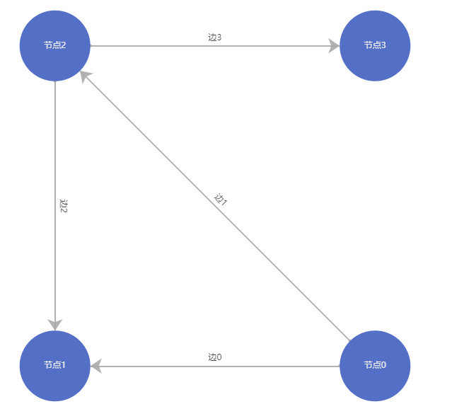


### 1.2 使用Postman发送请求

打开Postman软件，按照下图进行设置

框中的链接为： http://localhost:5000/getNeighbors ，Body中的数据为{"nodename": "节点0"}

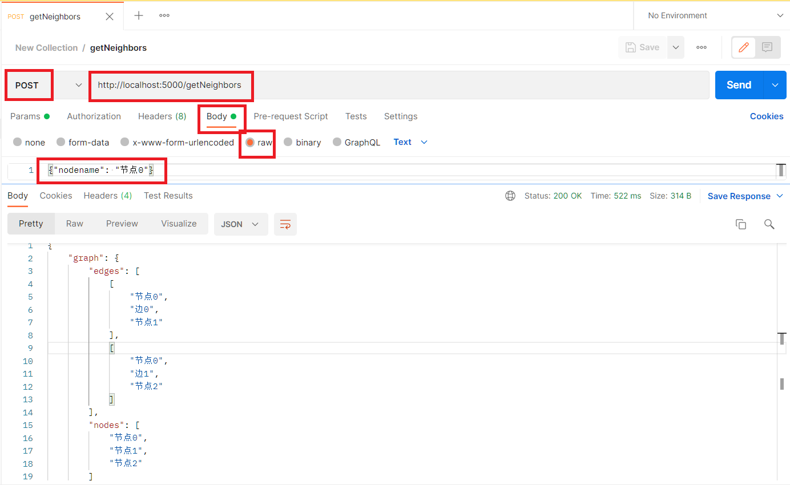

方框所示处确保与上图一致后，点击“Send”按钮，后端Python程序会在下方返回了以json格式存储的图数据，其中有两条边：（节点0，边0，节点1）、（节点0，边1，节点2）；有三个点：节点0、1和2。

其实 http://localhost:5000/getNeighbors 对应的这个请求链接，就是向Python请求某个点与其邻居构成的子图。而Body中的数据{"nodename": "节点0"}就是这个请求的参数封装的json，意思是查询的点的名称（nodename)是”节点0“。所以这个查询意思就是请求”节点0“与其邻居构成的子图，而Python接收到该请求后，通过调用内部函数得到数据并封装成json格式返回给Postman，就是我们看到的以json格式存储的有两条边与三个点的图数据。


### 1.3 后端服务主程序Server.py

如第1.1节中所述，其实整个后端直接运行的程序是Server.py，而其他文件夹（如Graph、BasicService）中的程序提供类与方法的接口，供Server.py或者其他类进行调用。接下来对Server.py的各部分进行解释

- 第一部分是初始化，因为在提供服务前各个类需要进行一些读数据、建索引之类的操作。

  ```python
  """
  initializations when start server service
  """
  graph = Graph("../data/DefaultDataset")                 	# load in graph data
  basicService = BasicService(graph)                          # initialize basic service
  moduleTemplate = ModuleTemplate(graph, inputVariable=100)   # initialize ModuleTemplate 
  ```

  第一句代码是初始化Graph这个类，并且传入图数据的来源"../data/DefaultDataset"；第二三行分别初始化BasicService与ModuleTemplate两个类，并且其中都将第一行载入完成的graph作为参数传入，以确保这两个类能访问到最底层的图数据信息。

- 第二部分定义了前端可以请求的接口

  ```python
  """
  APIs for front end
  """
  # get full graph
  @app.route('/getFullGraph',methods=['POST'])
  def getFullGraph():
      return basicService.getFullGraph()
  
  # get all neighbors of a node
  @app.route('/getNeighbors',methods=['POST'])
  def getNeighbors():
      responseDict = json.loads(str(request.get_data(), "utf8"))
      nodeName = responseDict.get('nodename')
      return basicService.getNeighbors(nodeName)
  ```

  第一个接口名为'/getFullGraph'，可以通过'POST'请求访问，然后会向发出请求者（比如Postman）返回结果。此处的结果来源于basicService类中的getFullGraph()函数，即返回了整张图。

  第二个接口名为'/getNeighbors'，可以通过'POST'请求访问，然后会向发出请求者（比如Postman）返回结果，其实就是第1.2节中Postman所发送的请求响应来源。注意到其中的第1~2行对请求的附加json数据进行解析，也就是在{"nodename": "节点0"}中提取出nodename变量值为“节点0”，并传递给basicService类中的getNeighbors(nodeName)函数，得到该点及其邻居构成的子图。

- 第三部分用于启动后端服务，访问服务的端口为5000。所以可以通过 http://localhost:5000 并加入具体请求路径（如 http://localhost:5000/getNeighbors ）发送请求。

  ```python
  """
  start the server
  """
  app.run(host='0.0.0.0', port=5000)  # 0.0.0.0代表本机任何地址均可访问
  ```

  

<br/>

## 2 后端接口说明文档


### 2.1 面向前端的请求响应接口

所有接口均位于Server.py文件中，函数前加入请求相关参数`@app.route('/functionName',methods=['POST'])`，例如：

```python
# get full graph
@app.route('/getFullGraph',methods=['POST'])
def getFullGraph():
    return basicService.getFullGraph()
```

#### getFullGraph（POST）

返回整个图

|            | 说明                                                         |
| ---------- | ------------------------------------------------------------ |
| 输入参数   | 无                                                           |
| 返回值     | json格式的图数据                                             |
| 返回值示例 | {'graph': {'nodes': ['节点0', '节点1', '节点2'], 'edges': [['节点0', '边0', '节点1'], ['节点0', '边1', '节点2']]}} |

#### getNeighbors（POST）

返回某个点及其一阶邻居所构成的子图，包括与邻居的连边

|              | 说明                                                         |
| ------------ | ------------------------------------------------------------ |
| 输入参数     | nodeName:string                                              |
| 输入参数示例 | {"nodename": "节点0"}                                        |
| 返回值       | json格式的图数据                                             |
| 返回值示例   | {'graph': {'nodes': ['节点0', '节点1', '节点2'], 'edges': [['节点0', '边0', '节点1'], ['节点0', '边1', '节点2']]}} |

#### testModuleTemplate（POST）

用于示意模板类的用法帮助理解项目框架，不用于生产环境

|              | 说明                                    |
| ------------ | --------------------------------------- |
| 输入参数     | variableFromFrontEnd:string             |
| 输入参数示例 | {"variableFromFrontEnd": "something"}   |
| 返回值       | 展示各个函数的执行结果，第3节中详细介绍 |


### 2.2 Graph类

提供大量底层图数据读写与数据转换接口

#### getNumberOfNodes()

获取当前图中的点数

|          | 说明 |
| -------- | ---- |
| 输入参数 | 无   |
| 返回值   | 整数 |

#### getNumberOfEdges()

获取当前图中的边数

|          | 说明 |
| -------- | ---- |
| 输入参数 | 无   |
| 返回值   | 整数 |

#### getAllnodeIdToName()

获取所有节点id到节点名称的映射关系

|            | 说明                                                 |
| ---------- | ---------------------------------------------------- |
| 输入参数   | 无                                                   |
| 返回值     | nodeIdToName:list, nodeIdToName[node id] = node name |
| 返回值示例 | ["节点0","节点1","节点2"]                            |

#### getAlledgeIdToName()

获取所有边id到边名称的映射关系

|            | 说明                                                 |
| ---------- | ---------------------------------------------------- |
| 输入参数   | 无                                                   |
| 返回值     | edgeIdToName:list, edgeIdToName[edge id] = edge name |
| 返回值示例 | ["边0","边1","边2"]                                  |

#### getAllTriples()

返回图中所有三元组（也即图的所有连边关系），三元组格式为（出节点id，边id，入节点id）

|            | 说明                                                         |
| ---------- | ------------------------------------------------------------ |
| 输入参数   | 无                                                           |
| 返回值     | triples:list, triples[edge id] = (head node id, edge id, tail node id) |
| 返回值示例 | [(0,0,1),(0,1,2)]                                            |

#### getNodeNameById(nodeId)

返回某个节点id对应的节点名称

|            | 说明                                      |
| ---------- | ----------------------------------------- |
| 输入参数   | nodeId:int                                |
| 输入示例   | nodeId=0                                  |
| 返回值     | nodeName:string（若nodeId不存在，返回-1） |
| 返回值示例 | "节点0"                                   |

#### getNodeIdByName(nodeName)

返回某个节点名称对应的节点id，一个节点名称只能对应一个节点id

|            | 说明                                   |
| ---------- | -------------------------------------- |
| 输入参数   | nodeName:string                        |
| 输入示例   | nodeName="节点0"                       |
| 返回值     | nodeid:int（若nodeName不存在，返回-1） |
| 返回值示例 | 0                                      |

#### getEdgeNameById(edgeId)

返回某条边id对应的边名称

|            | 说明                                      |
| ---------- | ----------------------------------------- |
| 输入参数   | edgeId:int                                |
| 输入示例   | edgeId=0                                  |
| 返回值     | edgeName:string（若edgeId不存在，返回-1） |
| 返回值示例 | "边0"                                     |

#### getEdgeIdByName(edgeName)

返回某条边名称对应的边id。由于可能多条边都有相同的名字，因此返回的是边id的列表

|            | 说明                                          |
| ---------- | --------------------------------------------- |
| 输入参数   | edgeName:string                               |
| 输入示例   | edgeName="边0"                                |
| 返回值     | edgeIds:list(int)（若edgeName不存在，返回-1） |
| 返回值示例 | [0]                                           |

#### getHeadAndTailNodeIdByEdgeId(edgeId)

返回某个边id对应的入点id与出点id

|            | 说明                                                   |
| ---------- | ------------------------------------------------------ |
| 输入参数   | edgeId:int                                             |
| 输入示例   | 0                                                      |
| 返回值     | (head node id, tail node id)（若edgeId不存在，返回-1） |
| 返回值示例 | (0,1)                                                  |

#### getInNeighbors(nodeId)

返回某个点的所有（入边id，对应入邻居节点id）构成的数组

|            | 说明                                                         |
| ---------- | ------------------------------------------------------------ |
| 输入参数   | nodeId:int                                                   |
| 输入示例   | 0                                                            |
| 返回值     | [(edgeid, in-neighbor id),...]（若nodeId不存在，返回-1）     |
| 返回值示例 | [(0,1),(1,2)]（节点0有一条入边id为0，对应的入邻居id为1；有另一条入边id为1，对应的入邻居id为2） |

#### getOutNeighbors(nodeId)

返回某个点的所有（出边id，对应出邻居节点id）构成的数组

|            | 说明                                                         |
| ---------- | ------------------------------------------------------------ |
| 输入参数   | nodeId:int                                                   |
| 输入示例   | 0                                                            |
| 返回值     | [(edgeid, out-neighbor id),...]（若nodeId不存在，返回-1）    |
| 返回值示例 | [(0,1),(1,2)]（节点0有一条出边id为0，对应的出邻居id为1；有另一条出边id为1，对应的出邻居id为2） |

#### addNewNode(nodeName)

向图中添加名为"nodeName"的新节点，并返回该新点的id。若该名称已经在图中存在，则直接返回其已有的id。

注意，此处只对内存中的图数据进行了修改，当程序终止时数据将丢失。请在进行一批修改操作后再调用saveToDataBase()函数，将已有数据存至磁盘中。不建议每添加一个点或一条边后写入磁盘，因为频繁写入磁盘将会产生大量的IO代价。

|            | 说明                                           |
| ---------- | ---------------------------------------------- |
| 输入参数   | nodeName:string                                |
| 输入示例   | "新节点"                                       |
| 返回值     | nodeId:int（若nodeName已存在，返回其已有的id） |
| 返回值示例 | 4                                              |

#### addNewEdge(headNodeName, edgeName, tailNodeName)

向图中添加新连边关系的三元组（入节点名称，边名称，出节点名），并返回（入节点id，边id，出节点id）。若入节点或出节点在图中不存在，会自动创建新节点；若已存在，则会使用其已有的节点id。

注意，此处只对内存中的图数据进行了修改，当程序终止时数据将丢失。请在进行一批修改操作后再调用saveToDataBase()函数，将已有数据存至磁盘中。不建议每添加一个点或一条边后写入磁盘，因为频繁写入磁盘将会产生大量的IO代价。

|            | 说明                                                      |
| ---------- | --------------------------------------------------------- |
| 输入参数   | headNodeName:string, edgeName:string, tailNodeName:string |
| 输入示例   | "入节点名称"，"一条边的名称"，"出节点名称"                |
| 返回值     | (headNodeId:int, edgeId:int, tailNodeId:int)              |
| 返回值示例 | (4,4,5)                                                   |

#### saveToDataBase()

将当前内存中的图信息保存至磁盘文件。请在进行一批修改操作后再调用saveToDataBase()函数，将已有数据存至磁盘中。不建议每添加一个点或一条边后写入磁盘，因为频繁写入磁盘将会产生大量的IO代价。

|            | 说明                        |
| ---------- | --------------------------- |
| 输入参数   | 无                          |
| 返回值     | 若写入成功返回0，否则返回-1 |
| 返回值示例 | 0                           |

#### toGraphJson(nodesIdList, idTriplesList)

将只涉及点与边id的图数据封装为前端所需的带名称的格式。只要是边三元组列表中涉及的节点都会被自动包括在内，因此当没有孤立点时（也即是不和任何边相连的点），则传入空列表[]作为nodeIdList即可。

|              | 说明                                                         |
| ------------ | ------------------------------------------------------------ |
| 输入参数     | nodesIdList:list(node id), idTriplesList:list(node id)       |
| 输入参数示例 | [],[(0,0,1),(0,1,2)]（将自动向节点列表中添加这两条边涉及的node id 0、1、2，因此可以传入nodesIdList=[]） |
| 返回值       | json格式的图数据                                             |
| 返回值示例   | {'graph': {'nodes': ['节点0', '节点1', '节点2'], 'edges': [['节点0', '边0', '节点1'], ['节点0', '边1', '节点2']]}} |


### 2.3 BasicService类

#### getFullGraph()

返回整个图，为Server.py中的getFullGraph请求响应提供具体服务接口

|            | 说明                                                         |
| ---------- | ------------------------------------------------------------ |
| 输入参数   | 无                                                           |
| 返回值     | json格式的图数据                                             |
| 返回值示例 | {'graph': {'nodes': ['节点0', '节点1', '节点2'], 'edges': [['节点0', '边0', '节点1'], ['节点0', '边1', '节点2']]}} |

#### getNeighbors(nodeId)

返回某个点及其一阶邻居所构成的子图，包括与邻居的连边，为Server.py中的getNeighbors请求响应提供具体服务接口

|              | 说明                                                         |
| ------------ | ------------------------------------------------------------ |
| 输入参数     | nodeName:string                                              |
| 输入参数示例 | "节点0"                                                      |
| 返回值       | json格式的图数据                                             |
| 返回值示例   | {'graph': {'nodes': ['节点0', '节点1', '节点2'], 'edges': [['节点0', '边0', '节点1'], ['节点0', '边1', '节点2']]}} |


<br/>

## 3 后端模块开发

请根据功能需要自行在backend文件夹中创建子文件夹，命名为模块名称并在其中编写代码。例如，现有代码中已创建一个模块名为"ModuleTemplate"，该文件夹下有一个Python文件名为"ModuleTemplate.py"，其中包含了一个类（class）名为"ModuleTemplate"。


### 3.1 变量与函数

在编写类中代码时，请区分私有变量（private variable）与公共变量（public variable），私有函数（private method）与公共函数（public method）。Python中的私有变量/函数为变量名/函数名前加上两个下划线，如：__privateVariableName。虽然Python并没有像C++或Java一样完全隔绝外界对私有变量的读写，但做好区分能尽量避免外界访问甚至修改一些不该访问的变量或函数。在编写代码时，请勿调用其他类中的私有变量或函数。

由于各个模块基本需要访问图信息，因此设置__graph变量为图数据的API接口实例。"ModuleTemplate"模块中还分别定义了私有变量与公有变量：

```python
"""
private variables
"""
__graph:Graph                   # graph database
__privateVariableName = None    # private variable, only can be access by functions in this class

"""
public variable
"""
publicVariableName = None       # public variable, can be access by other programs
```


### 3.2 类初始化函数

类中有一个初始化函数，可以接受图数据读写的API接口实例，以及自定义的各种输入参数，并进行某些初始化操作，比如索引建立。

```python
def __init__(self, graph:Graph, inputVariable):
    """
    initialization, input must contain the graph api class
    you can add other input variables if you need
    """
    self.__graph = graph
    # do something here, such as initialize your own data
    print("initialize module template, and the input variable is "+str(inputVariable))
```

注意，需要在Server.py文件中实例化该模块，才能完成参数传递与初始化。如：

```python
"""
initializations when start server service
"""
graph = Graph("../data/DefaultDataset")                     # load in graph data
basicService = BasicService(graph)                          # initialize basic service
moduleTemplate = ModuleTemplate(graph, inputVariable=100)   # initialize ModuleTemplate 
```

上方的代码首先初始化了Graph类，并将其实例graph传递给BasicService类完成其初始化。在第三行中，本节中定义的"ModuleTemplate"类也进行了初始化，传入了graph以及自定义的inputVariable变量，并将该类的实例存为moduleTemplate，方便面向前端的接口调用。


### 3.3 私有函数示例

此处以__getFullGraph()函数为例，该函数将整个图进行了返回，注释中用例子具体阐述了前端所需要的图数据格式，供大家熟悉。建议通过`self.__graph.toGraphJson(nodesIdList, idTriplesList)`函数完成转换，若需要自行转换也请务必严格按照注释中所介绍的json格式

```python
def __getFullGraph(self):
    """
    A private function, only functions inside this class can invoke it
    note that you should describe its input and output variable format here
    this function can return the full graph in json format
    """

    """
    if you need to show a graph in frontend, you need to return the correct json format
    An example graph is:    1 -> 2 -> 3
    Its correct json format is:
    {
        'graph':{
            'nodes': ['name of node 1', 'name of node 2', 'name of node 3'],
            'edges': [  ['name of node 1', 'name of edge 1->2', 'name of node 2'],
                            ['name of node 2', 'name of edge 2->3', 'name of node 3']   ]
        }
    }
    There is an API to help you return the correct json format, 
    what you need is to prepare a list of node id and id triples
    then invoke function "self.__graph.toGraphJson(node id list, id triples list)"
    then you can "return {'graph': self.__graph.toGraphJson(node id list, id triples list)}"
    """
    # the following send the whole graph to frontend
    return {'graph': self.__graph.toGraphJson([], self.__graph.getAllTriples())}
```


### 3.4 公有函数示例

此处以testAllAPIs(variableFromFrontEnd)函数为例。该函数测试了所有Graph类下的图数据读写API，并将结果以json格式返回。Graph类下的图数据读写API的具体说明与用法请见第2.2节。本函数对应着面向前端的响应接口，具体执行逻辑请见第3.5节。

```python
def testAllAPIs(self, variableFromFrontEnd):
    """
    A public function, note that you should describe its input and output variable format here
    this function can test all the APIs and return there answer
    """

    # assign value to private variable
    self.__privateVariableName = "I am a private variable!"

    # test all APIs and return answer
    return {
        'private variable': self.__privateVariableName,
        'public variable': self.publicVariableName,
        'variable from front end': variableFromFrontEnd,
        'getNumberOfNodes': self.__graph.getNumberOfNodes(),
        'getNumberOfEdges': self.__graph.getNumberOfEdges(),
        'getAllnodeIdToName': self.__graph.getAllnodeIdToName(),
        'getAlledgeIdToName': self.__graph.getAlledgeIdToName(),
        'getAllTriples': self.__graph.getAllTriples(),
        'getNodeNameById(0)': self.__graph.getNodeNameById(0),
        'getNodeIdByName(节点0)': self.__graph.getNodeIdByName("节点0"),
        'getEdgeNameById(0)': self.__graph.getEdgeNameById(0),
        'getEdgeIdByName(边0)': self.__graph.getEdgeIdByName("边0"),
        'getHeadAndTailNodeIdByEdgeId(0)': self.__graph.getHeadAndTailNodeIdByEdgeId(0),
        'getInNeighbors(2)': self.__graph.getInNeighbors(2),
        'getOutNeighbors(2)': self.__graph.getOutNeighbors(2),
        'addNewNode(节点4)': self.__graph.addNewNode("节点4"),
        'addNewEdge(节点4,边5,节点5)': self.__graph.addNewEdge("节点4","边4","节点5"),
        'saveToDataBase()': self.__graph.saveToDataBase(),
        'toGraphJson([],[(0,0,1),(0,1,2),(2,2,1),(2,3,3)])': self.__graph.toGraphJson([],[(0,0,1),(0,1,2),(2,2,1),(2,3,3)]),
        'self.__getFullGraph()': self.__getFullGraph()
    }
```


### 3.5 面向前端接口的执行

#### 3.5.1 通过Postman发送请求

首先请按第1.1节的提示运行Server.py，完成启动后，请打开Postman，按下图所示输入相应信息：

框中的链接为：http://localhost:5000/testModuleTemplate ，Body中的数据为{"variableFromFrontEnd":"哈哈哈哈哈"}

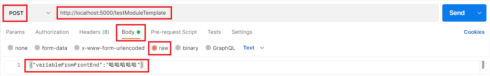

点击“Send”，可以看到下方显示了大量API接口返回的结果：

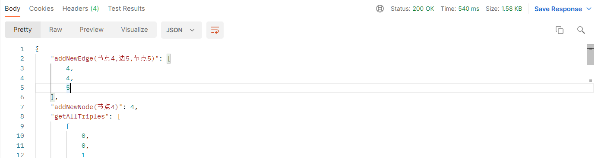

#### 3.5.2 接口的执行逻辑

当Postman（或者前端JavaScript）向 http://localhost:5000/testModuleTemplate 发出POST请求时，首先位于 http://localhost:5000 的后端Python服务会接收到具体请求路径为`/testModuleTemplate`，在Server.py中找到对应此请求路径的函数执行：

```python
# test module template 
@app.route('/testModuleTemplate',methods=['POST'])
def testModuleTemplate():
    
    # get the input data from front end
    responseDict = json.loads(str(request.get_data(), "utf8"))
    variableFromFrontEnd = responseDict.get('variableFromFrontEnd')
    
    # modify public variable
    moduleTemplate.publicVariableName = "I am a public variable!"
    
    # invoke the public function
    return moduleTemplate.testAllAPIs(variableFromFrontEnd)
```

在上方的函数中：

- 第一部分首先从请求数据中提取前端传来的参数，也就是Postman中Body中的数据{"variableFromFrontEnd":"哈哈哈哈哈"}。提取出的值暂存于variableFromFrontEnd变量中
- 第二部分对moduleTemplate实例中的公有变量publicVariableName进行赋值
- 第三部分调用moduleTemplate实例的testAllAPIs()函数并传入第一部分中得到的variableFromFrontEnd变量，将其返回值发送回Postman（或前端的JavaScript）

接下来深入第三部分所调用的testAllAPIs()函数，也就是ModuleTemplate.py文件中的ModuleTemplate类下的testAllAPIs()函数：

```python
def testAllAPIs(self, variableFromFrontEnd):
    """
    A public function, note that you should describe its input and output variable format here
    this function can test all the APIs and return there answer
    """
    
    # assign value to private variable
	self.__privateVariableName = "I am a private variable!"

    # test all APIs and return answer
    return {
        'private variable': self.__privateVariableName,
        'public variable': self.publicVariableName,
        'variable from front end': variableFromFrontEnd,
        'getNumberOfNodes': self.__graph.getNumberOfNodes(),
        'getNumberOfEdges': self.__graph.getNumberOfEdges(),
        'getAllnodeIdToName': self.__graph.getAllnodeIdToName(),
        'getAlledgeIdToName': self.__graph.getAlledgeIdToName(),
        'getAllTriples': self.__graph.getAllTriples(),
        'getNodeNameById(0)': self.__graph.getNodeNameById(0),
        'getNodeIdByName(节点0)': self.__graph.getNodeIdByName("节点0"),
        'getEdgeNameById(0)': self.__graph.getEdgeNameById(0),
        'getEdgeIdByName(边0)': self.__graph.getEdgeIdByName("边0"),
        'getHeadAndTailNodeIdByEdgeId(0)': self.__graph.getHeadAndTailNodeIdByEdgeId(0),
        'getInNeighbors(2)': self.__graph.getInNeighbors(2),
        'getOutNeighbors(2)': self.__graph.getOutNeighbors(2),
        'addNewNode(节点4)': self.__graph.addNewNode("节点4"),
        'addNewEdge(节点4,边5,节点5)': self.__graph.addNewEdge("节点4","边4","节点5"),
        'saveToDataBase()': self.__graph.saveToDataBase(),
        'toGraphJson([],[(0,0,1),(0,1,2),(2,2,1),(2,3,3)])': self.__graph.toGraphJson([],[(0,0,1),(0,1,2),(2,2,1),(2,3,3)]),
        'self.__getFullGraph()': self.__getFullGraph()
    }
```

上方函数中：

- 第一部分对私有变量self.__privateVariableName进行赋值
- 第二部分测试了所有Graph类下的图数据读写API，并将结果以json格式返回给Server.py中的testModuleTemplate()函数，再返回至Postman（或者前端JavaScript）。也就是第3.5.1节中看到的返回内容。


## 4 远程服务器部署

### 4.1 服务器配置

由于Python后端是通过5000端口提供服务，因此服务器必须暴露5000接口以供前端或Postman访问，另外前端页面是通过8080端口访问的。第一步必须在DBCloud管理后台添加8080端口与5000端口：

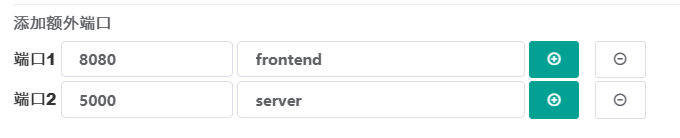

DBCloud后端会显示该实例的5000端口所对应的主机实际端口。当Python程序运行在服务器上时，Postman中需要向该地址与端口发送请求，而不是之前所用的本地服务地址localhost:5000。

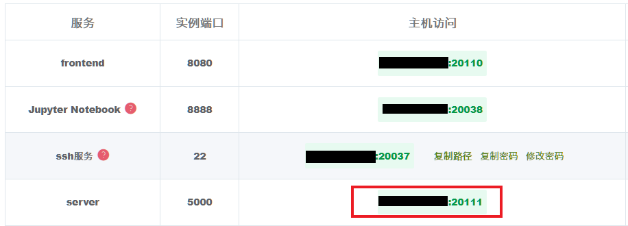


### 4.2 前端配置

为了能通过链接直接访问网页，首先在服务器中安装nginx并运行nginx，执行以下命令：

```
sudo apt-get install nginx
nginx
```

在浏览器中打开DBCloud后台显示的8080端口的实际链接与端口，可以看到如下界面：

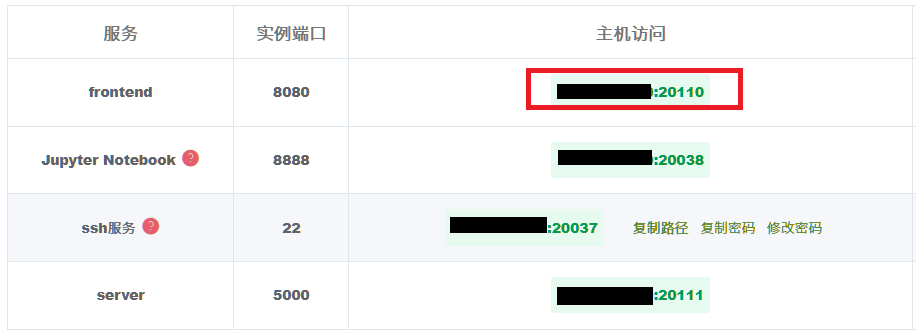

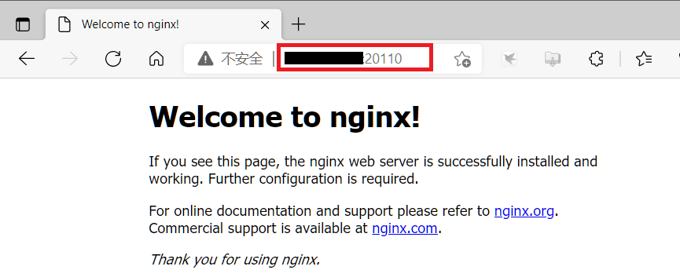

接下来将前端代码打包成可部署至服务器的生产模式，在frontend文件夹下执行如下命令：

```
npm run build
```

打包完毕后可以看到frontend文件夹下新增了一个dist文件夹，将dist文件夹上传至服务器根目录下的home文件夹中。打开/etc/nginx/nginx.conf文件，在其中http的配置的最后加入如下内容（应该是在第63行）：

```
server {
       		listen 8080;
        	server_name localhost;
        	location / {
                	root /home/dist;
					index index.html;
  		        	try_files $uri $uri/ /index.html;
        	}
        	location /api {  
            		proxy_pass http://localhost:5000; 
					rewrite "^/api/(.*)$" $1 break;	
        	} 
	}
```

运行如下命令检查配置文件并重启nginx：

```
nginx -t
nginx -s reload
```

在浏览器中打开DBCloud后台显示的8080端口的实际链接与端口，可以看到如下界面：

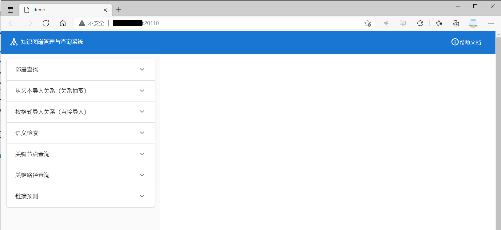

可以看到此时网页中并未展现图信息，这是因为在该实例中还未运行后端Python服务，自然前端也没办法获得图数据。下一节将在服务器中启动后端服务。


### 4.3 运行后端程序

将整个代码包传至服务器后，记得先pip install需要的包（pip install flask），然后运行Server.py。

然后在Postman中输入第4.1节中所述的主机实际地址与端口，以及其他相应信息，即可访问到结果：

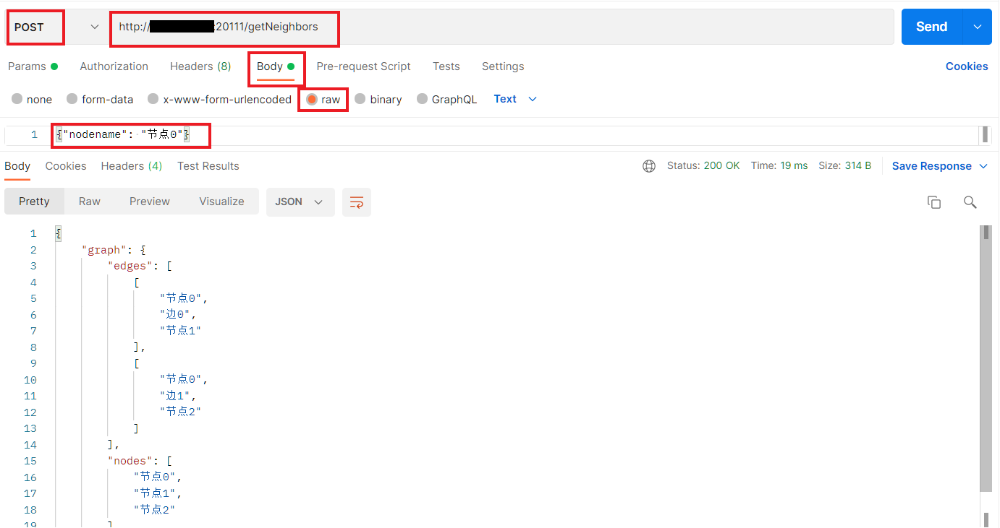

在确保Python后端正常运行的情况下，在浏览器中打开DBCloud后台显示的8080端口的实际链接与端口，可以看到前端的图：

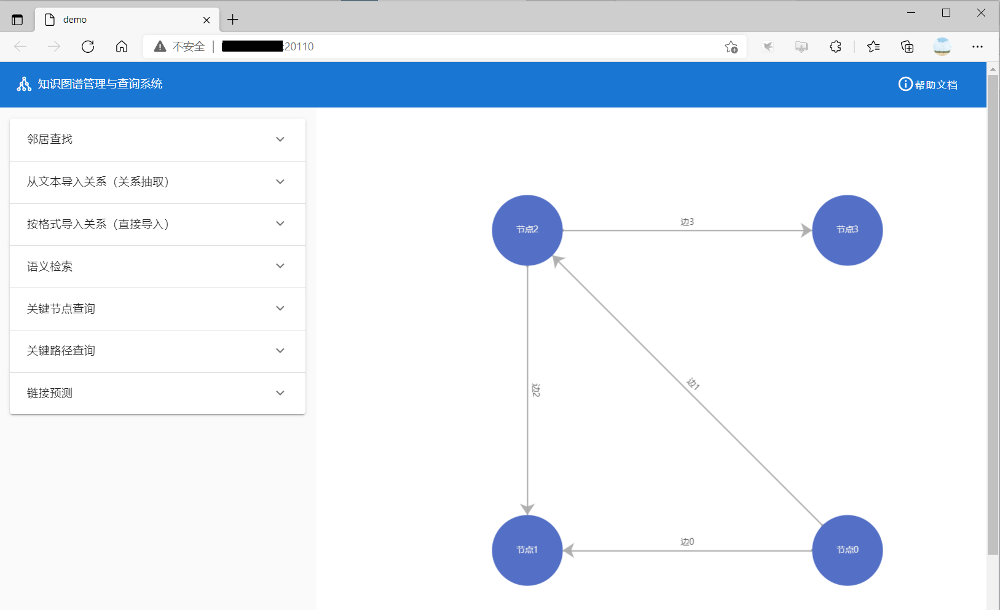

此时若在后端Python程序中对图信息进行了一定的修改，刷新网页就能直接看到更新后图数据。

